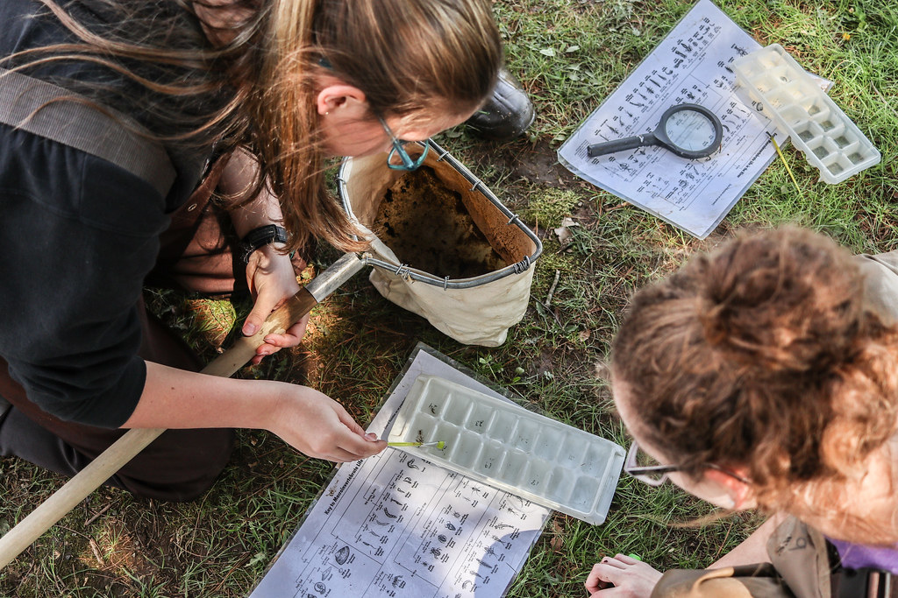
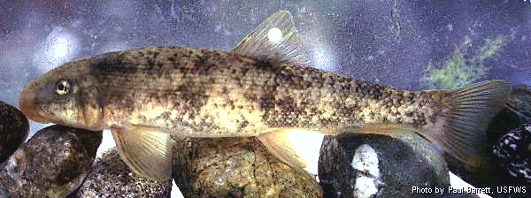
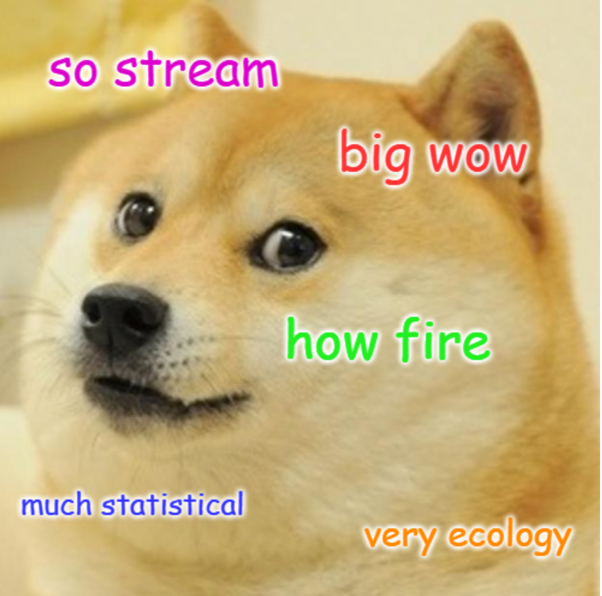

```{r setup, include=FALSE}
# Necessary packages:

library(learnr)
library(tidyverse) 
library(agricolae)
library(kableExtra)

# Necessary data:

chemical_parameters <- read_csv('casestudy_chem.csv')

physical_parameters <- read_csv('casestudy_phys.csv') %>% 
  mutate(score = select(., substrate:riparian_right) %>%  rowSums())

algae <- read_csv('casestudy_algae.csv')

inverts <- read_csv('casestudy_inverts.csv') %>% 
  mutate(IBI = (coleoptera+ept+predator+collector+intolerant+noninsect+tolerant)/70)

fish_abundance <- read_csv('casestudy_fish_abundance.csv') %>% 
  mutate(abundance = pass_1 + pass_2 + pass_3,
         density = abundance/reach_length*1000)

fish_condition <- read_csv('casestudy_fish_condition.csv')

# Tutorial options:

tutorial_options(exercise.timelimit = 10)

```

<style type="text/css">
.table {

    width: 500px;

}
</style>

## Study System

### Big Tujunga Creek and the Station Fire

Big Tujunga Creek is located in northern Los Angeles County, CA . The stream begins in the San Gabriel Mountains and is dammed twice (Big Tujunga Dam and Hansen Dam, each of which forms a reservoir of the same name), before emptying into the Los Angeles River near Studio City, CA. In late August and early September of 2009, the Station Fire burned the majority of the area surrounding the creek; however, some areas were burned more intensely than others.

**Experimental Design:**

- *Predictor Variable:* site or group (burned vs. unburned)
- *Response Variables:* physical, chemical, algal, invertebrate, and fish parameters

### **Task:** Case Study

Your job in this case study is to use your knowledge of stream ecology to identify the burned sites, write a report summarizing the effects of the fire on the river, and  propose a mitigation plan to restore the river. You will examine data on the creek’s physical parameters and water quality, as well as algal, invertebrate, and fish datasets. All data were collected in mid-September 2009, immediately after the fire.

**Resources on Gauchospace:**

- "Case study materials" folder
  - Case study outline
  - Grading rubric
  - Methods information for field and lab methodology
  - Scientific writing tips
  - Literature search tools
- "Case study slides" folder
  - Powerpoint slides from section with background information
- "Case study literature" folder
  - Ten useful papers you may want to cite in your report
- "Case study data" folder
  - Raw data files in CSV format

***Note:*** *Even if you close the window for this tutorial, your browser should save your progress locally...unless you clear your browser data.*

## CHEMICAL PARAMETERS

The research team measured seven chemical parameters:

| Variable Name | Chemical Parameter | Units |
| :- | :- | :- |
| `ph` | acidity | mg/L |
| `do` | dissolved oxygen | mg/L |
| `phosphate` | PO~4~ | mg/L |
| `nitrogen` | total nitrogen | mg/L |
| `ec` | electrical conductivity | $\mu$S/cm |
| `temp` | temperature | $^{\circ}$ Celsius |
| `turbidity` | turbidity | % light transmission |

```{r chemical-data, echo=FALSE}
chemical_parameters
```

## -- Statistics

### t-test

$\bigstar$ **Task:** Run a t-test for each chemical parameter.

The chemical parameter variables are: `ph`, `do`, `phosphate`, `nitrogen`, `ec`, `temp`, and `turbidity`.

```{r chem-ttest, exercise = TRUE}

# Run a t-test to determine whether the mean varied by group
t.test(VARIABLE ~ group,
       data = chemical_parameters)

```

## -- Graph

$\bigstar$ **Task:** Visualize the data using a bar chart. Error bars represent standard error.

The chemical parameter variables are: `ph`, `do`, `phosphate`, `nitrogen`, `ec`, `temp`, and `turbidity`.

```{r chemical-plot, exercise=TRUE, fig.width=3, fig.height=3}

# Create a summary table for plotting:
chemical_summary <- chemical_parameters %>% 
  group_by(group) %>% 
  summarise(mean = mean(VARIABLE),
            se = sd(VARIABLE)/sqrt(length(VARIABLE)))

# Create a graph using the summary table:
ggplot(chemical_summary, aes(x = group, y = mean, fill = group)) +
  geom_col() + 
  scale_fill_manual(values = c("tan1", "steelblue")) +
  geom_errorbar(aes(ymin = mean - se, ymax = mean + se),
                width = 0.2, position = position_dodge(.9)) +
  scale_y_continuous(expand = c(0,0)) +
  theme_classic() +
  theme(legend.position = 'none') +
  labs(title = "Mean Value",
       x = "Group", y = "Chemical Parameter")

```

<div id="chemical-plot-hint">
**Hint:** If you want to change the title of the graph and the y-axis label to match the parameter that you are testing, try updating the text in quotes at the end of the code chunk!
</div>

## PHYSICAL PARAMETERS

The research team measured the ten physical parameters listed in the **Rapid Bioassessment Protocol.** Three parameters were measured twice each: once for each side of the stream. Ultimately, the physical parameter values for each of the ten variables were summed into a cumulative Physical Habitat Quality Score.

| Variable Name | Physical Parameter |
| :- | :- |
| `substrate` | **1.** Epifaunal Substrate / Available Cover |
| `embed` | **2.** Embeddedness |
| `regime` | **3.** Velocity/Depth Regimes |
| `sediment` | **4.** Sediment Deposition |
| `flow` | **5.** Channel Flow Status |
| `channel` | **6.** Channel Alteration |
| `riffles` | **7.** Frequency of Riffles |
| `bank_left` | **8a.** Bank Stability (left bank) |
| `bank_right` | **8b.** Bank Stability (right bank) |
| `veg_left` | **9a.** Vegetative Protection (left bank) |
| `veg_right` | **9b.** Vegetative Protection (right bank) |
| `riparian_left` | **10a.** Riparian Vegetative Zone Width (left bank) |
| `riparian_right` | **10b.** Riparian Vegetative Zone Width (right bank) |
| `score` | *Physical Habitat Quality Score* (sum of physical parameter scores) |

```{r physical-data-score, echo=FALSE}
physical_parameters
```

## -- Statistics

### ANOVA

$\bigstar$ **Task:** Run an ANOVA for each physical parameter, as well as for the Physical Habitat Quality Score.

The physical parameter variables are: `substrate`, `embed`, `regime`, `sediment`, `flow`, `channel`, `riffles`, `bank_left`, `bank_right`, `veg_left`, `veg_right`, `riparian_left`, and `riparian_right`. The variable name for the Physical Habitat Quality Score is `score`.

```{r physical-ANOVA, exercise=TRUE}

# Run an ANOVA to determine whether the mean varies by site

phys_anova <- aov(VARIABLE ~ site,
                  data = physical_parameters)
summary(phys_anova)

```

<br>

#### Post-hoc Tukey test

$\bigstar$ **Task:** Run a Tukey test for each physical parameter that significantly varied between sites.

The physical parameter variables are: `substrate`, `embed`, `regime`, `sediment`, `flow`, `channel`, `riffles`, `bank_left`, `bank_right`, `veg_left`, `veg_right`, `riparian_left`, and `riparian_right`. The variable name for the Physical Habitat Quality Score is `score`.

```{r physical-Tukey, exercise=TRUE}

# Run a Tukey test using the output from the ANOVA

phys_anova <- aov(VARIABLE ~ site,
                  data = physical_parameters)
phys_tukey <- HSD.test(phys_anova, "site")
print(phys_tukey$groups)

```

## -- Graph

$\bigstar$ **Task:** Visualize the data using a bar chart. Error bars represent standard error.

- Please update the graph before adding it to your case study report!
- Change the bar fill color by adjusting the code in the indicated line. Check out [this webpage](http://www.stat.columbia.edu/~tzheng/files/Rcolor.pdf) to see all of the color options offered.
- Change the titles for the graph and axes by replacing the text in the appropriate lines.

The physical parameter variables are: `substrate`, `embed`, `regime`, `sediment`, `flow`, `channel`, `riffles`, `bank_left`, `bank_right`, `veg_left`, `veg_right`, `riparian_left`, and `riparian_right`. The variable name for the Physical Habitat Quality Score is `score`.

```{r physical-plot, exercise=TRUE, fig.width=5, fig.height=3}

# Create a summary table for plotting:
physical_summary <- physical_parameters %>% 
  group_by(site, group) %>% 
  summarise(
    mean = mean(VARIABLE),
    se = sd(VARIABLE)/sqrt(length(VARIABLE))
  )

# Create a graph using the summary table:
ggplot(physical_summary, aes(x = site, y = mean, fill = group)) +
  geom_col() + 
  scale_fill_manual(values = c("grey", "grey")) + # CHANGE COLOR HERE
  geom_errorbar(aes(ymin = mean - se, ymax = mean + se),
                width = 0.2, position = position_dodge(.9)) +
  scale_y_continuous(expand = c(0,0)) +
  theme_classic() +
  theme(legend.position = 'none') +
  labs(title = "GRAPH TITLE",
       x = "X-AXIS LABEL",
       y = "Y-AXIS LABEL")
       
```


## ALGAE

The research team measured two algal parameters:

| Variable Name | Algal Parameter | Units |
| :- | :- | :- |
| `afdm` | Ash Free Dry Mass (AFDM) | mg/L |
| `chla` | Chlorophyll-*a* (Chl-*a*) | mg/L |

```{r algae-data, echo=FALSE}
algae
```

## -- Statistics

### ANOVA

$\bigstar$ **Task:** Run an ANOVA for both AFDM and Chl-*a*.

The variable names are: `afdm` and `chla`.

```{r algae-ANOVA, exercise=TRUE}

# Run an ANOVA to determine whether the mean varies by site

algae_anova <- aov(VARIABLE ~ site,
                  data = algae)
summary(algae_anova)

```

<br>

#### Post-hoc Tukey test

$\bigstar$ **Task:** Run a Tukey test for both AFDM and Chl-*a*.

The variable names are: `afdm` and `chla`.

```{r algae-Tukey, exercise=TRUE}

# Run a Tukey test using the output from the ANOVA

algae_anova <- aov(VARIABLE ~ site,
                  data = algae)
algae_tukey <- HSD.test(algae_anova, "site")
print(algae_tukey$groups)

```

## -- Graph

$\bigstar$ **Task:** Visualize the data using a bar graph. Error bars represent standard error.

The variable names are: `afdm` and `chla`.

```{r algae-plot, exercise=TRUE, fig.width=5, fig.height=3}

# Create a summary table for plotting:
algae_summary <- algae %>% 
  group_by(site, group) %>% 
  summarise(
    mean = mean(VARIABLE),
    se = sd(VARIABLE)/sqrt(length(VARIABLE))
  )

# Create a graph using the summary table:
ggplot(algae_summary, aes(x = site, y = mean, fill = group)) +
  geom_col() + 
  scale_fill_manual(values = c("tan1", "steelblue")) +
  geom_errorbar(aes(ymin = mean - se, ymax = mean + se),
                width = 0.2, position = position_dodge(.9)) +
  scale_y_continuous(expand = c(0,0)) +
  theme_classic() +
  theme(legend.position = 'none') +
  labs(title = "Mean Algal Biomass",
       x = "Site", y = "Algal Biomass")
       
```

## INVERTEBRATES

The researchers sampled invertebrate communities using a kick-net, which collects benthic macroinvertebrates. 

```{r kicknet, echo=FALSE, out.height="50%", out.width="50%"}

```

<br>

The researchers measured the **seven metrics** for the SoCal B-IBI. These variables have the suffix "_raw" because they represent the raw data.

| Variable Name | Metric | Units | 
| :- | :- | :- | 
|`coleoptera_raw` | Coleoptera taxa | Number of taxa |
| `ept_raw` | EPT taxa | Number of taxa |
| `predator_raw` | Predator taxa | Number of taxa |
| `collector_raw` | % of collector individuals | % of all individuals | 
| `intolerant_raw` | % of intolerant individuals | % of all individuals |
| `noninsect_raw` | % of non-insect taxa | % of taxa | 
| `tolerant_raw` | % of tolerant taxa | % of taxa |

```{r raw-invert-data, echo=FALSE}
inverts %>% 
  select(-c(coleoptera:tolerant))
```

<br>

Before conducting analyses, the raw data were converted to metric scores, using Table 3 in Ode et al. (2005). These scores can then be used to calculate the SoCal B-IBI.

| Variable Name | Metric Score | Units | 
| :- | :- | :- | 
|`coleoptera` | Score for Coleoptera taxa | Scale (0-10) |
| `ept` | Score for EPT taxa | Scale (0-10) |
| `predator` | Score for Predator taxa | Scale (0-10) |
| `collector` | Score for % of collector individuals | Scale (0-10) | 
| `intolerant` | Score for % of intolerant individuals | Scale (0-10) |
| `noninsect` | Score for % of non-insect taxa | Scale (0-10) | 
|`tolerant` | Score for % of tolerant taxa | Scale (0-10) |
|`IBI` | SoCal B-IBI | % |

```{r invert-data, echo=FALSE}
inverts %>% 
  select(-c(coleoptera_raw:tolerant_raw))
```

## -- Statistics

### t-test

$\bigstar$ **Task:** Run a t-test for each invertebrate metric (using the raw data), as well as the SoCal B-IBI.

The variable names for the seven metrics are: `coleoptera_raw`, `ept_raw`, `predator_raw`, `collector_raw`, `intolerant_raw`, `noninsect_raw`, and `tolerant_raw`. The variable name for the SoCal B-IBI is `IBI`.

```{r ibi-ttest, exercise = TRUE}

# Run a t-test to determine whether the mean varied by group
t.test(VARIABLE ~ group,
       data = inverts)

```

## -- Graph

**MAKE SURE YOU HAVE COMPLETED THE SOCAL B-IBI CALCULATION BEFORE CREATING A BAR CHART.**

$\bigstar$ **Task:** Visualize the raw data, as well as the SoCal B-IBI, using a bar chart. Error bars represent standard error.

The variable names for the seven metrics are: `coleoptera_raw`, `ept_raw`, `predator_raw`, `collector_raw`, `intolerant_raw`, `noninsect_raw`, and `tolerant_raw`. The variable name for the SoCal B-IBI is `IBI`.

- Please update the graph of SoCal B-IBI before adding it to your case study report!
- Change the bar fill color by adjusting the code in the indicated line. Check out [this webpage](http://www.stat.columbia.edu/~tzheng/files/Rcolor.pdf) to see all of the color options offered.
- Change the titles for the graph and axes by replacing the text in the appropriate lines.

```{r ibi-plot, exercise=TRUE, fig.width=3, fig.height=3}

# Create a summary table for plotting:
invert_summary <- inverts %>% 
  group_by(group) %>% 
  summarise(mean = mean(VARIABLE), 
            se = sd(VARIABLE)/sqrt(length(VARIABLE)))

# Create a graph using the summary table: 
ggplot(invert_summary, aes(x = group, y = mean, fill = group)) +
  geom_col() + 
  scale_fill_manual(values = c("grey", "grey")) + # CHANGE COLOR HERE
  geom_errorbar(aes(ymin = mean - se, ymax = mean + se),
                width = 0.2, position = position_dodge(.9)) + 
  scale_y_continuous(expand = c(0,0)) + 
  theme_classic() + 
  theme(legend.position = "none") + 
  labs(title = "GRAPH TITLE",
       x = "X-AXIS TITLE",
       y = "Y-AXIS TITLE")

```

## FISH DENSITY

The **Santa Ana sucker** (*Catostomus santaanae*) is endemic to the Los Angeles, San Gabriel, and Santa Ana river systems, and is listed as an IUCN endangered species. Big Tujunga Creek is one of the only remaining places where Santa Ana suckers can be found.

```{r sucker, echo=FALSE}

```

<br>

To sample populations of the Santa Ana sucker, the researchers used 3-pass depletion electroshocking. Here are their raw data:

| Variable Name | Measurement | Units | 
| :- | :- | :- | 
| `reach_length` | Length of the sample reach | meters (m) |
| `pass_1` | Fish caught during electroshock pass #1 | Number of individuals |
| `pass_2` | Fish caught during electroshock pass #2 | Number of individuals |
| `pass_3` | Fish caught during electroshock pass #3 | Number of individuals |

```{r abundance-data, echo=FALSE}
fish_abundance[,-c(7:8)]
```

<br>

Before conducting analyses, these raw values were converted to a total abundance, and then density of fish in the stream.

| Variable Name | Measurement | Units | 
| :- | :- | :- | 
| `abundance` | Total fish abundance | Number of individuals |
| `density` | Fish density | Individuals/ km |

```{r density-data, echo=FALSE}
fish_abundance[,-c(3:6)]
```

## -- Statistics

### t-test

$\bigstar$ **Task:** Interpret the t-test for fish density.

```{r density-ttest}

# Run a t-test to determine whether the mean fish density varied by group
t.test(density ~ group,
       data = fish_abundance)

```


## -- Graph

$\bigstar$ **Task:** Interpret the data using a bar chart. Error bars represent standard error.

```{r fish-plot, echo=FALSE, fig.width=3, fig.height=3}

# Create a summary table for plotting:
density_summary <- fish_abundance %>%
  group_by(group) %>%
  summarise(mean = mean(density),
            se = sd(density)/sqrt(length(density)))

# Create a graph using the summary table:
ggplot(density_summary, aes(x = group, y = mean, fill = group)) +
  geom_col() +
  scale_fill_manual(values = c("tan1", "steelblue")) +
  geom_errorbar(aes(ymin = mean - se, ymax = mean + se),
                width = 0.2, position = position_dodge(.9)) +
  scale_y_continuous(expand = c(0,0)) +
  theme_classic() +
  theme(legend.position = "none") +
  labs(title = "Mean Fish Density",
       x = "Group",
       y = "Fish Density (individuals/km)")

```

## FISH CONDITION

The researchers measured the weight and length of every Santa Ana sucker captured, and then calculated Fulton's K factor to assess fish health.

| Variable Name | Metric | Units | 
| :- | :- | :- | 
| `K` | Fulton's K Factor (fish body condition) | g/cm^3 | 

Because fish abundance varied between sites, the sample sizes were not equal. This table shows the sample size for each site:

```{r k-summary, echo=FALSE}
fish_summary <- fish_condition %>%
  group_by(site, group) %>%
  summarise(n = length(K))
cols <- c('Site','Group','Sample Size (n)')
kable(fish_summary, col.names = cols) %>% 
  kable_styling(bootstrap_options = c('striped', 'condensed'),
                full_width = FALSE,
                position = 'left') %>% 
  column_spec(1, width = '2cm')
```

<br>

Here are the raw data presented in a table.

```{r k-data, echo=FALSE}
fish_condition
```

## -- Statistics

### ANOVA

$\bigstar$ **Task:** Interpret the ANOVA for fish body condition (K).

```{r K-ANOVA}

# Run an ANOVA to determine whether the mean fish body condition varied by site
K_anova <- aov(K ~ site,
                 data = fish_condition)
summary(K_anova)

```

<br>

#### Post-hoc Tukey test

$\bigstar$ **Task:** Interpret the Tukey test for fish body condition (K).

```{r K-Tukey}

# Run a Tukey test using the output from the ANOVA
K_anova <- aov(K ~ site,
               data = fish_condition)
K_tukey <- HSD.test(K_anova, "site")
print(K_tukey$groups)

```

## -- Graph

$\bigstar$ **Task:** Interpret the data using a bar chart. Error bars represent standard error.

```{r K-plot, echo=FALSE, fig.width=5, fig.height=3}

# Create a summary table for plotting:
K_summary <- fish_condition %>%
  group_by(group, site) %>%
  summarise(mean = mean(K),
            se = sd(K)/sqrt(length(K)))

# Create a graph using the summary table:
ggplot(K_summary, aes(x = site, y = mean, fill = group)) +
  geom_col() +
  scale_fill_manual(values = c("tan1", "steelblue")) +
  geom_errorbar(aes(ymin = mean - se, ymax = mean + se),
                width = 0.2, position = position_dodge(.9)) +
  scale_y_continuous(expand = c(0,0)) +
  theme_classic() +
  theme(legend.position = "none") +
  labs(title = "Mean Fish Body Condition",
       x = "Site",
       y = "K Factor")

```

## Sources

```{r doge, echo=FALSE, out.height="50%", out.width="50%"}

```

Data modified from dataset courtesy of Thomas Even.

Tutorial by Kate Culhane (kathrynculhane@ucsb.edu).